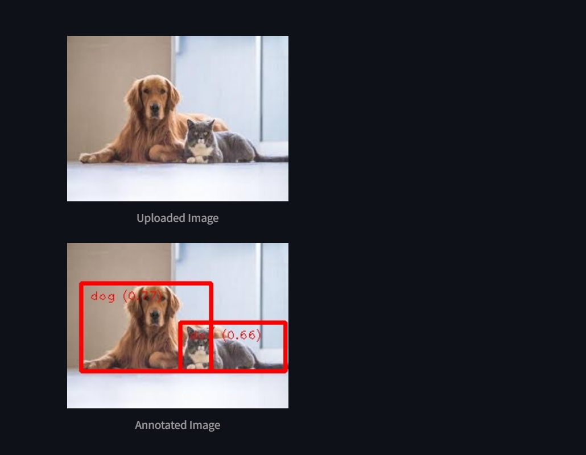

# 🧠 MediaPipe Object Detection App

A simple and elegant web application for **object detection** using [MediaPipe's EfficientDet Lite model](https://developers.google.com/mediapipe/solutions/vision/object_detector) and [Streamlit](https://streamlit.io/).

## 🚀 Features

- 🔍 Detects objects in uploaded **images** using a pre-trained TensorFlow Lite model.
- 📦 Displays bounding boxes and labels directly on the image.
- 📋 Lists detected objects with their confidence scores.
- 🖼️ Interactive and clean user interface built with Streamlit.
- ⚡ Fast and efficient inference using **MediaPipe Tasks API**.

---

## 🖥️ Demo


> Upload an image and see object detection results instantly.

---

## 📁 Project Structure

```

object\_detection\_app/
│
├── app.py                # Main Streamlit app
├── efficientdet\_lite0.tflite  # Object detection model
├── requirements.txt      # Python dependencies
├── README.md             # Project documentation

````

---

## 📦 Installation

1. Clone the repository:

```bash
git clone https://github.com/your-username/object-detection-app.git
cd object-detection-app
````

2. Install dependencies:

```bash
pip install -r requirements.txt
```

3. Run the app:

```bash
streamlit run app.py
```

---

## 🔍 Model Used

* `efficientdet_lite0.tflite` from MediaPipe's object detection models.
* Designed for **real-time mobile and web applications**.
* Detects general objects like people, cars, bottles, etc.

Download the model from [MediaPipe Model Zoo](https://developers.google.com/mediapipe/solutions/vision/object_detector#models) and place it in the project folder.

---

## 📋 Example Usage

* Select or drag & drop an image.
* The app will:

  * Show the original image.
  * Run object detection.
  * Display the annotated image with bounding boxes and labels.
  * List all detected objects and their scores.

---

## 🛠️ Built With

* [MediaPipe](https://mediapipe.dev/)
* [Streamlit](https://streamlit.io/)
* [OpenCV](https://opencv.org/)
* [NumPy](https://numpy.org/)

---

## 📌 Notes

* Ensure the file `efficientdet_lite0.tflite` is available in the working directory.
* The app uses `score_threshold=0.5` to filter weak detections.

---

## 📃 License

This project is licensed under the MIT License — feel free to use and modify it.

---

## ✨ Acknowledgments

* Thanks to the [MediaPipe team](https://github.com/google/mediapipe) for providing cutting-edge vision tools.

